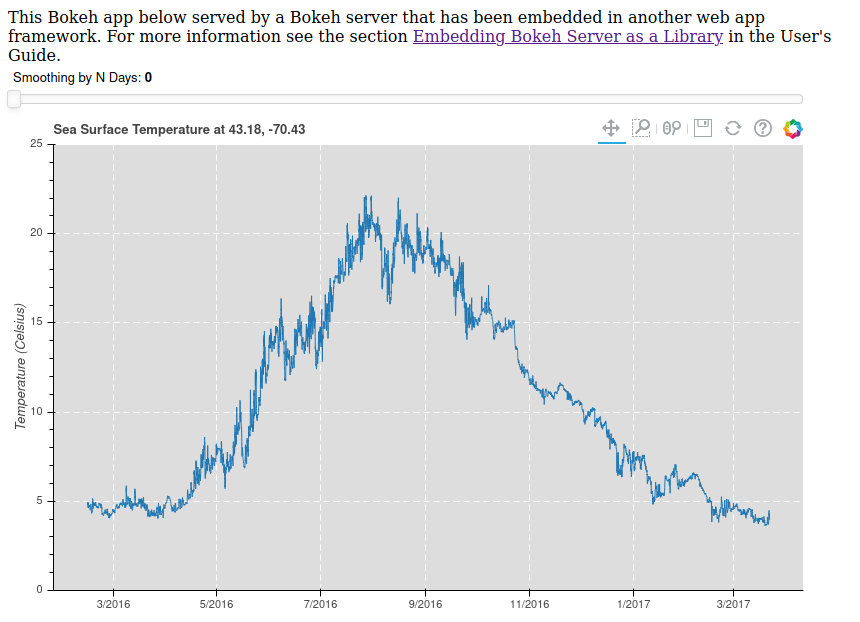

# flask-bokeh-server

Embed Bokeh applications which are running on a Bokeh server to Jinja templates with Flask and Gunicorn.

Scripts in this repo are modified according to the example given in [flask_gunicorn_embed.py](https://github.com/bokeh/bokeh/blob/master/examples/howto/server_embed/flask_gunicorn_embed.py) from Bokeh repo.
The main difference between this repo and `flask_gunicorn_embed.py` is that here we split it into three parts and store them into separate files:
- creating Bokeh application in `bk_app.py`
- running this application on Bokeh server in `bk_server.py`
- calling the url to this application and rendering the script for embedding it (`view.py`)

## Prerequisites
- UNIX environment (because of Gunicorn)
- Python 3.7+

## Dependencies
- bokeh >= 2.1.1
- flask >= 1.1.2
- gunicorn >= 20.0.4
- pandas >= 1.0.5

## Installation
- Clone this repo
- `cd flask-bokeh-server`
- Install the dependencies as listed above. You can either install packages that are listed above by hand, or run
`pip install -r requirements.txt`

## Run
Once the installation is finished, you can run the server through

- `cd api`
- `gunicorn -w 4 run:app`

Visit `http://localhost:8000` with your choice of browser. You should see the following:

